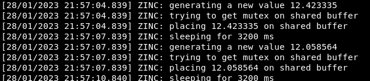
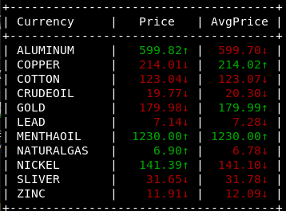

# Producer Consumer Problem Using System V IPC 🤝

This program utilizes the power of System V IPC to solve the classic problem of producer-consumer, where multiple producers generate data and multiple consumers consume them.The challenge is to synchronize these two entities and avoid any race conditions.

## Explaination 📖

### What is the producer consumer problem?

The producer-consumer problem is a classic concurrency problem in computer science, in
which multiple producers generate data items and multiple consumers process them. The
problem is to ensure that the producers do not produce too quickly for the consumers to keep
up, and that the consumers do not consume too quickly for the producers to catch up. This car
be achieved using synchronization mechanisms such as semaphores or message queues.

<p align="center" width="100%">

</p>

### How to solve this problem? 💻

#### Solution using system V IPC (Inter Process Communication)

System V IPC (Inter-Process Communication) is a set of inter-process communication mechanisms provided by the System V operating system family, which includes UNIX and Linux.

It includes three main components:

* message queues, which allow processes to send and receive messages
* semaphores, which provide a mechanism for synchronizing access to shared resources
* shared memory, which allows multiple processes to share a region of memory.

These mechanisms are implemented in the kernel, and are accessible to user-space processes
through system calls. They provide a way for processes to coordinate and synchronize their
activities, and are commonly used in multi-process and multi-threaded applications.

### Code Need to Know 📊

#### Producer

Each producer is supposed to continuously declare the price of one commodity. For simplicity, we assume that each commodity price follows a normal distribution with parameters  (𝜇, 𝜎^2).

While running a producer, you will specify the following
command line arguments:

* Commodity name (e.g., GOLD – Assume no more than 10 characters.)
* Commodity Price Mean; 𝜇 – a double value.
* Commodity Price Standard Deviation; 𝜎 – a double value.
* Length of the sleep interval in milliseconds; T – an integer.
* Bounded-Buffer Size (number of entries); N – an integer.

```sh
gnome-terminal -- ./producer ALUMINIUM 600 0.6 2000 40
```

<p align="center" width="100%">

</p>

**in run.sh you will find already made demo with 10 diffrent producers**

#### Consumer

The consumer is to print the current price of each commodity, along the average of the current and past 4 readings. An Up/Down arrow to show whether the current Price (AvgPrice) got increased or decreased from the prior one.

While running the consumer, you will specify the following command line argument:

* Bounded-Buffer Size (number of entries); N – an integer.

<p align="center" width="100%">

</p>

## Table of contents :label:

| File Name | Description                                                                                      |
|-----------|--------------------------------------------------------------------------------------------------|
| [producer.cpp](https://github.com/XMaroRadoX/Producer-Consumer-Problem-Using-System-V-IPC/blob/master/producer.cpp)   | Contians the implementation of producer code using OOP principles|
| [consumer.cpp](https://github.com/XMaroRadoX/Producer-Consumer-Problem-Using-System-V-IPC/blob/master/consumer.cpp) | Contains the implementation of consumer code using OOP principles            |
| [Makefile](https://github.com/XMaroRadoX/Matrix-Multipication-using-posix-threads/blob/master/Makefile)  | Used to run the program                                                                          |
| [run.sh](https://github.com/XMaroRadoX/Producer-Consumer-Problem-Using-System-V-IPC/blob/master/run.sh)| contains run commands used by Makefile|

### Pre-requisites :screwdriver:

* Linux : Ubuntu or any debian based distro
* gnome-terminal
* C Compiler
* make

#### Install pre-requisites :toolbox:

Have to be on debian-based distro that have apt as it's package manager to run these commands

```sh
sudo apt update && sudo apt install gcc make gnome-terminal
```

### Run :green_circle:

* Navigate to directory
* Run Make

`make`

### Licensing :pencil:

This code is licensed under the MIT License.

### Authors :pen:

* Marwan Radwan

### Contribution :clinking_glasses:

Feel free to contribute just make a pull request and do what you wish. 😼

[](https://opensource.org/licenses/MIT)

